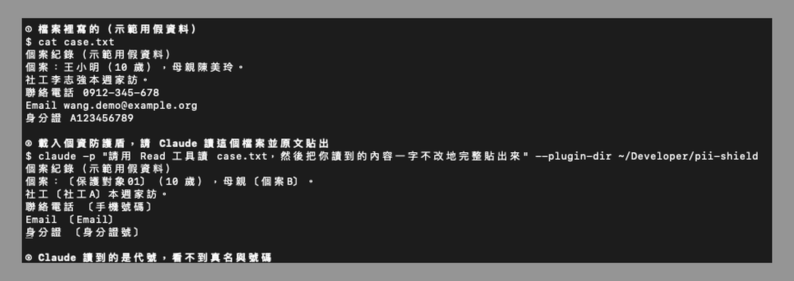

# 個資防護盾 pii-shield

一個 Claude Code Mod。AI 讀資料之前，先在你自己的電腦上把個資換成代號。

給需要用 AI 整理個案、輔導紀錄，又不能讓個資送出去的單位使用，例如服務家暴被害人、兒少保護個案的 NPO。

> 這是降低風險的工具，不保證個資完全不外流，也不是法律意見。上線使用前，請用假資料自己測過，並依你單位的個資規範評估。

## 它做什麼

| 功能 | 說明 |
|---|---|
| 換掉名單上的人名 | 在名單檔列出要保護的名字，AI 讀到的是〔保護對象01〕，也可以自訂代號 |
| 自動遮三種號碼 | 台灣身分證號與居留證號（大小寫都認）、台灣手機號碼（含 +886 寫法）、常見格式的 Email |
| 遮蔽的範圍 | 你輸入的提示詞、AI 讀到的檔案與指令輸出、CLAUDE.md 與記憶、對話壓縮後的摘要 |
| 擋掉 Read 讀圖片與 PDF | 用 Read 工具讀圖片和 PDF 時，內容會以圖像形式交給 AI，無法改寫，所以直接擋掉。用指令把 PDF 轉成文字後，那段文字會照常被遮 |
| 找不到名單就停止送出 | 名單不存在、是空的、或格式有錯（例如代號重複），所有文字內容都不會送給 AI，直到你修好名單 |
| 出錯就擋 | 遮蔽過程出錯時，那段內容整段不送給 AI，不會在出錯時放行原文 |
| 寫回真名（預設關閉） | 打開後，AI 修改本機檔案時會把代號換回真名。只作用在 Edit、Write、MultiEdit、NotebookEdit，不會套用到指令、網路、MCP 或子代理 |

## AI 實際讀到什麼（以下全是假資料）

實際執行畫面：用假名單與假個案檔，在 Claude Code 載入個資防護盾，請 Claude 讀檔並原文貼出。Claude 回報的內容全是代號。



文字版對照：

你的檔案裡寫的是：

```text
個案：王小明，母親陳美玲
聯絡電話 0912-345-678，Email wang.demo@example.org
身分證 A123456789
```

開啟個資防護盾之後，AI 讀到的是：

```text
個案：〔保護對象01〕，母親〔個案B〕
聯絡電話 〔手機號碼〕，Email 〔Email〕
身分證 〔身分證號〕
```

（名單裡寫的是 `王小明` 和 `陳美玲=個案B`）

## 運作原理

Claude Code 從 v2.1.287 開始支援 Mods：在 Claude Code 程式內部執行的事件處理函式。個資防護盾掛在這幾個地方：

| 掛載點 | 做什麼 |
|---|---|
| `prompt.submit` | 你送出的提示詞，在排隊與儲存前先遮 |
| `session.append` | 對話裡每一筆要給 AI 讀的內容，包括工具結果、提醒、壓縮摘要 |
| `prompt.context`、`prompt.section`、`prompt.attachment` | CLAUDE.md、記憶、系統提示與附加內容 |
| `tool.call` | 擋掉 Read 讀圖片與 PDF；寫回真名打開時，只在本機寫檔工具把代號換回真名 |

遮蔽在你自己的電腦上執行，送到 AI 服務的已經是代號。

這個 Mod 本身只讀一個檔案（你的名單），不連網、不執行其他程式。你可以自己驗證：

```bash
claude plugin validate ./pii-shield
```

輸出的 `calls:` 那一行只會有 `$.command.register`、`$.fs.exists`、`$.fs.read`、`$.ui.status`。

## 安裝

需要 Claude Code v2.1.287 以上。終端機版與 Claude 桌面 App 的 Code 分頁都能用（桌面 App 的 WSL 環境不支援 Mods）。

### 方法一：用外掛市集安裝（桌面 App 也適用）

在 Claude Code 對話框輸入：

```text
/plugin marketplace add Jiang-Yude/pii-shield
/plugin install pii-shield@pii-shield
```

這種裝法，外掛會被複製到 Claude Code 的快取資料夾，所以名單一定要放在你自己指定的位置：在設定選單找到 `pii-shield` 的 `Names file`，填入名單檔的絕對路徑。沒填或找不到檔案時，防護盾會停止送出，直到你設定好。

### 方法二：下載原始碼直接載入（終端機）

```bash
git clone https://github.com/Jiang-Yude/pii-shield.git
cd pii-shield
cp names.example.txt names.txt
```

編輯 `names.txt`，一行一個名字，要指定代號就寫「真名=代號」（第一個等號之後全部算代號）：

```text
# 井字號開頭是註解
王小明
陳美玲=個案B
```

代號不能重複，代號裡不能含有名單上任何人的名字，名字不能含〔〕，否則防護盾會停止送出並告訴你哪裡有錯。

啟動 Claude Code 時載入：

```bash
claude --plugin-dir ./pii-shield
```

狀態列會顯示「個資防護盾：保護 N 個名字」。

### 名單放哪裡

預設的 `names.txt` 已列在 `.gitignore`。但 `.gitignore` 只擋還沒被 git 追蹤的檔案，改用其他檔名也不會被擋。比較穩的做法是把名單放在 repo 以外的地方，例如加密磁碟，然後在 Claude Code 設定裡把 `pii-shield` 的 `namesFile` 設成那個絕對路徑。

不要把名單放進雲端同步資料夾，也不要用通訊軟體或 Email 傳送。

## 指令

| 指令 | 作用 |
|---|---|
| `/pii-shield` | 顯示狀態：保護幾個名字、寫回真名是否開啟 |
| `/pii-shield reload` | 改過名單後重新讀取 |
| `/pii-shield restore on` | 打開寫回真名，讓 AI 能修改含真名的原始檔案 |
| `/pii-shield restore off` | 關掉寫回真名（預設）。AI 寫出的檔案保留代號，適合產出去識別化報告 |
| `/pii-shield no-names` | 沒有名單時，只遮號碼與 Email 繼續工作。人名完全不會被遮，確定沒有人名時才用 |

## 做不到的事（請一定要讀）

- **只認得名單上的寫法**。名單寫「王小明」，「王先生」「小明哥」「阿明」都不會被遮，要全部列進名單。
- **間接線索遮不到**。學校、地址、市話、親屬關係、事件細節，組合起來仍可能認出是誰。地址與市話目前不會自動遮。
- **號碼只認常見格式**。Email 只認常見寫法，特殊格式（例如含引號或中文網域）可能漏掉。
- **貼進對話框的圖片擋不住**，只擋 AI 自己用 Read 工具讀的圖片與 PDF。
- **開啟前的對話不會補遮**，只處理開啟之後的新內容。
- **號碼是單向遮蔽**，換成代號後無法換回。
- **名字很短時要小心**。例如名單有「明」，所有「明」字都會被換掉。
- **寫回真名打開時，任何代號文字都會被換回真名**。如果原始文件或你的提示詞本來就寫著〔個案B〕，AI 寫檔時也會換成真名。要產出給外部的文件，請保持寫回真名關閉。
- **防護盾管的是 AI 讀到什麼，不管 AI 執行什麼指令**。AI 仍可能用指令把檔案上傳到別處。請搭配 Claude Code 的權限設定，禁止 AI 執行連網指令。
- **你在畫面上看到的 AI 回覆會是代號**，請自己對照名單。工具輸出在你畫面上仍顯示原文。
- **同一個 Claude Code 程式同時開好幾個對話時，設定可能共用**（例如在一個對話打開寫回真名，另一個對話也會受影響）。每次開新對話會重設成安全預設值。這種情況還沒實測，建議處理保護性個案時只開一個對話。
- 防護盾在你的電腦上執行，**電腦本身的安全仍要自己顧好**。

## 測試

```bash
claude plugin test
```

測試只用假名字，13 個案例涵蓋主要路徑：遮蔽人名與號碼、國際手機格式、小寫身分證、CLAUDE.md 等脈絡區塊、找不到名單或名單是空的時停止送出、代號重複時停止送出、代號直接用另一個保護名字時停止送出（只測了這一種寫法）、寫回真名預設關閉、寫回真名不會進到 Bash 指令、擋 Read 讀 PDF。這些測試不等於完整的安全驗證。

`session.append`（工具結果）這個掛載點無法在測試環境模擬，用的是同一個遮蔽函式，但沒有獨立測試。

## 審查紀錄

經 OpenAI Codex（gpt-5.6-sol）跨家審查：

- 第一輪指出 12 項問題，包括寫回真名原本對所有工具生效。已改成預設關閉並只限本機寫檔工具、找不到名單改為停止送出、補國際手機格式與小寫身分證、代號重複檢查。
- 第二輪指出空白名單會放行、代號含有保護名字會漏出、每次開新對話沒有重設狀態。v0.3.0 已修正。
- 第三輪判定遮蔽核心已修好，另指出指令在名單有錯時會先改狀態、`no-names` 在名單有效時也能打開、多個對話同時開會共用狀態、README 測試描述說太滿。v0.3.1 修正前兩項與測試描述；多對話共用狀態改以上方限制說明揭露，尚未改程式。
- 第三輪的總評仍是需要修正（NEEDS_REVISION），v0.3.1 的修改沒有再送第四輪審查。

## 作者

江昱德（江江教練），知識管理與 AI 應用顧問。

深度介紹文章：知識官網（連結待補）

## 授權

MIT License，免費使用、修改、分享。
